  

  
  &nbsp;&nbsp;
  
  &nbsp;&nbsp;
  

  

  
  
  
  
  

  

---

## System overview

I am an Electronics and Communication Engineering undergraduate building at the intersection of **embedded systems, IoT, cyber-physical systems, Edge AI, and digital twins**. I turn research ideas into working prototypes—from architecture and firmware through testing, validation, and real-time integration.

- 🔬 Exploring digital-twin research and real-time, multi-node sensor networks.
- 🛰️ Building with MQTT, CoAP, ESP-NOW, BLE, Zigbee, and edge hardware.
- 🧠 Deploying computer-vision and NLP workloads on resource-constrained systems.
- 🏗️ Previously a Project Intern in Applied Cyber-Physical Systems at **NITK Surathkal**.
- ✍️ Writing about finance at [FirstLive](https://sonalhhegde.wixsite.com/firstlive).
- 📫 Reach me at **sonalhhegde@gmail.com**.

> “How much money does it take to make a human happy? Just one more dollar.”

---

## Hardware and technology stack

### Embedded systems and hardware

  
  
  
  
  
  
  
  
  

### IoT, networking, and protocols

  
  
  
  
  
  
  

### AI, machine learning, and computer vision

  
  
  
  
  
  
  
  

### Languages, web, automation, and design

  

  
  
  
  
  
  

---

## Selected builds

| Project | What I built | Stack / impact |
|---|---|---|
| **Digital Twin Smart Transportation System** | Real-time platform with 10+ sensors and a distributed six-node railway-safety network | ESP32, Raspberry Pi, MQTT, CoAP, ESP-NOW, GSM |
| **IoT Energy Profiler** | Portable measurement system tracking voltage, current, power, and energy across five operating modes | STM32L476RG, INA219, ESP32-C3, I2C |
| **Marine Debris Detection** | Real-time drone-imagery pipeline optimized for edge deployment | YOLOv8, OpenCV, Jetson Nano; **90%+ accuracy** |
| **Smart Medication Dispenser** | RTC scheduling, stepper actuation, cloud monitoring, and reminders | ESP32, Embedded C, AWS IoT; **85% fewer errors** in prototype testing |
| **TruthSnap** | Multi-modal phishing detection using URLs, page content, OCR, and visual indicators | Python, Tesseract, NLP, CV; **92% accuracy** |
| **Kuldio ESG Platform** | Transformer pipeline extracting and classifying sustainability metrics | Python, NLP, Transformers; **70% less manual effort** |
| **VU Meter** | Custom PCB audio visualizer from schematic through assembly and test | LM3914, analog signal conditioning, PCB fabrication |

---

## GitHub analytics

  
  

  

## Contribution stream

  <picture>
    <source media="(prefers-color-scheme: dark)" srcset="https://raw.githubusercontent.com/sonalhegde/sonalhegde/output/github-contribution-grid-snake-dark.svg" />
    <source media="(prefers-color-scheme: light)" srcset="https://raw.githubusercontent.com/sonalhegde/sonalhegde/output/github-contribution-grid-snake.svg" />
    
  </picture>

From circuits to intelligence—building systems where hardware meets the real world.

